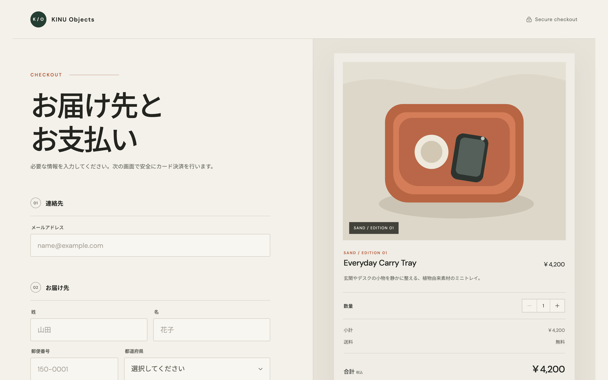
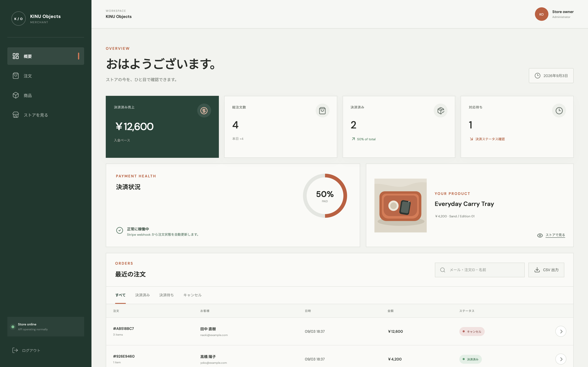
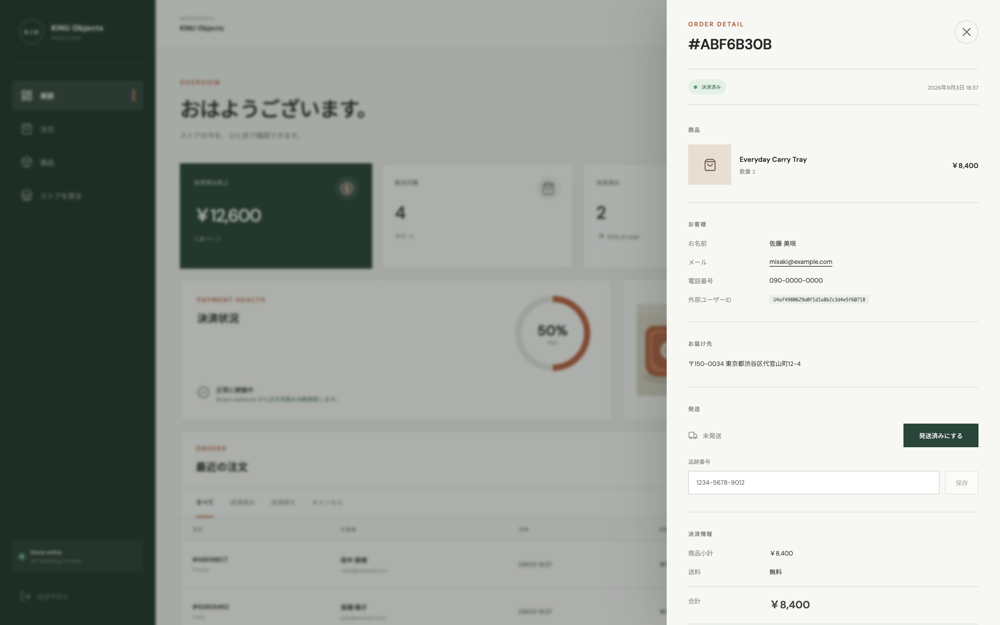

# Nano Checkout

**日本語** | [English](README.en.md)

LINE ミニアプリやネイティブアプリに決済を組み込むための、ヘッドレスなチェックアウト基盤です。

Shopify や Wix の決済画面はアプリの中に埋め込めません。ユーザーを外部ブラウザへ送り出した時点で購入体験が途切れます。Nano Checkout が返すのは注文 ID と Stripe の決済 URL だけなので、LINE LIFF からでも iOS / Android アプリからでも、自分の画面のまま注文を作れます。物理的な商品の販売にアプリ内課金は不要なため、アプリでも自前の決済導線を持てます。

- 注文に LINE ユーザー ID やアプリの利用者 ID を紐づけられるので、発送通知をメールではなく LINE やプッシュで届けられます
- 日本向け: 円建て、都道府県の住所フォーム、特定商取引法に基づく表記ページを同梱
- 商品管理・受注管理・発送管理の画面つき
- API は Hono、データベースは Postgres、決済は Stripe Hosted Checkout

同梱の React 製ストアフロントは参照実装のひとつです。自分のアプリだけで使う場合は不要です。iOS（Swift）と LINE LIFF の実装例は [API ドキュメント](docs/API.md)の第 4 章と第 5 章にあります。

```bash
npm install && npm run dev
```

環境変数なしで起動します。メモリ DB とデモ決済で動くので、`http://localhost:5173` を開けば数分で注文の一連の流れを確認できます。

| ストアフロント（参照実装） | 管理画面 |
| --- | --- |
| [](docs/images/storefront.png) | [](docs/images/admin-dashboard.png) |

## 現時点でできないこと

先に把握しておいてください。用途に合わない場合、ここで分かります。

- **通貨は日本円のみ。** `currency` は `jpy` に固定しています。他通貨はスキーマから変更が必要です。
- **消費税の内訳を持ちません。** 価格は税込の整数ひとつです。税率と税額を保持していないため、**適格請求書（インボイス）は発行できません**。B2B 販売で必要な場合は自分で実装してください。
- **1 注文につき 1 商品。** カートはありません。数量は 1〜5 です。複数商品をまとめる場合は注文明細のテーブルから設計が必要です。
- **返金・キャンセルの API はありません。** Stripe ダッシュボードから操作してください。
- **定期購入は対象外です。** 都度課金のみです。
- **LINE Messaging API への送信コードは含みません。** `externalUserId` を保存するところまでが範囲で、通知の実装は各自の LINE 公式アカウントで行います。
- **MCP は固定トークン認証です。** OAuth 2.1 には対応していません。

## ローカルで起動

Node.js 20 以上が必要です。

```bash
npm install
npm run dev
```

`http://localhost:5173` を開いてください。環境変数を設定しない場合はメモリ DB とデモ決済で起動するため、UI と注文フローをすぐ確認できます。

商品データは Postgres の `checkout_products` テーブルが正本で、管理画面から編集します。初期商品はマイグレーションで自動作成されます。販売中の商品が 1 件もない場合、ストアは購入不可の状態を表示し、注文 API は `409` を返します。

`src/config/order-spec.ts` にはストア名と、特定商取引法に基づく表記ページの内容を定義します。**販売事業者名、運営責任者、所在地、電話番号は雛形の値が入っています。公開前に実際の事業者情報へ必ず置き換えてください。**

## 本番環境変数

`.env.example` を参照し、次をプラットフォームのシークレットとして登録します。値をリポジトリへコミットしないでください。

- `STRIPE_SECRET_KEY`
- `STRIPE_WEBHOOK_SECRET`
- `CHECKOUT_PII_KEY` — `openssl rand -base64 32` で一度だけ生成。変更すると既存 PII を復号できません。
- `CHECKOUT_LOOKUP_PEPPER` — `openssl rand -hex 32` で生成。
- `ADMIN_PASSWORD_HASH` — `npm run admin:hash -- "十分に長いパスワード"` の出力を設定。
- `ADMIN_SESSION_SECRET` — `openssl rand -hex 32` で生成（32 文字以上）。
- `APP_URL` — 例: `https://shop.example.com`
- `DATABASE_URL` — Cloudflare Hyperdrive を使う場合は不要。
- `MCP_TOKEN` — 任意。設定すると AI 連携用の MCP エンドポイントが有効になります。`openssl rand -hex 32` で生成（32 文字以上）。

テーブルは `migrations/` 内の SQL を番号順（`0000_checkout_orders.sql` → `0001_checkout_products.sql` → `0002_order_fulfillment.sql` → `0003_order_external_user.sql`）に SQL エディタで実行するか、`DIRECT_URL` を指定して `npm run db:push` で作成します。

## Cloudflare Pages + Hyperdrive（推奨）

1. Cloudflare Pages にリポジトリを接続し、ビルドコマンドを `npm run build`、出力を `dist` にします。
2. Neon、Supabase、または自前 Postgres を作成します。Supabase は東京リージョンを選び、本番の `DATABASE_URL` には 6543 の transaction pooler を使います。マイグレーション用 `DIRECT_URL` には 5432 を使います。
3. Hyperdrive を作成します。

   ```bash
   npx wrangler hyperdrive create nano-checkout-db --connection-string="postgres://..."
   ```

4. 出力された ID を使い、`wrangler.toml` の `[[hyperdrive]]` セクションを有効にします。Pages の Settings → Bindings で `HYPERDRIVE` という名前で追加する方法でも構いません。
5. 上記シークレットを Pages の Settings → Variables and Secrets に登録してデプロイします。
6. Stripe Workbench で `https://あなたのドメイン/api/webhooks/stripe` を webhook として登録し、次のイベントを選びます。
   - `checkout.session.completed`
   - `checkout.session.async_payment_succeeded`
   - `checkout.session.async_payment_failed`
   - `checkout.session.expired`

`public/_routes.json` は Worker を `/api/*` に限定します。`/confirm/` は `OrderSpec` からビルド時に生成され、静的アセットとして配信されるため Worker の呼び出しを消費しません。

> Supabase Free は非アクティブなプロジェクトを一時停止することがあります。実際に注文を受けるストアでは有料プラン、Neon、または監視を含む自前 Postgres を利用してください。

## 管理画面

`/admin/` で注文管理を行います。売上と注文数の集計、支払いステータスによる絞り込み、注文検索、復号された購入者情報と配送先を確認できます。管理セッションは署名付きの `HttpOnly`、`SameSite=Strict` Cookie に保存され、パスワードは PBKDF2 ハッシュとしてのみ設定します。ログインに 8 回連続で失敗した送信元 IP は 15 分間ブロックします。この回数は実行中のインスタンスのメモリで数えるため、複数インスタンス構成では Cloudflare 側のレート制限も併用してください。

ローカルで `ADMIN_PASSWORD_HASH` を設定していない場合はデモ管理画面が有効になり、`http://localhost:5173/admin/` にパスワード `nano-demo-2026` でログインできます。本番アダプターではこの既定パスワードは有効にならず、管理者用の環境変数が不足していると起動を拒否します。

### 発送管理

注文の詳細から発送状況を記録できます。

- 決済済みの注文を「発送済み」にすると発送日時を記録します。取り消しも可能です。
- 追跡番号を保存できます。
- 注文一覧を CSV で書き出せます。日本語が文字化けしないよう UTF-8 BOM 付きで出力します。

購入者の氏名は暗号化して保存しているためデータベース側では検索できません。検索ボックスはメールアドレスと注文 ID をサーバーで検索し、氏名は読み込み済みの一覧に対して絞り込みます。

[](docs/images/admin-order.png)

注文詳細には、LINE やアプリから渡された外部ユーザー ID も表示されます。この ID を使って発送通知を送ります。

### 商品管理

管理画面の「商品管理」では次を行えます。

- 商品の新規作成と編集
- SKU、商品名、エディション、説明、価格、送料の設定
- 有限在庫または在庫無制限
- 下書き、販売中、アーカイブの各ステータス
- ワンクリックでの公開・非公開切り替えとストアフロントのプレビュー

公開クライアントは次を呼び出せます。

```http
GET /api/storefront/products
GET /api/storefront/products/:sku
```

Web では `/?product=SKU` で指定商品をプレビューできます。iOS、Android、LINE も同じ SKU で注文を作成します。

```json
{
  "sku": "everyday-tray-01",
  "quantity": 1,
  "email": "buyer@example.com",
  "familyName": "山田",
  "givenName": "花子",
  "postalCode": "150-0001",
  "prefecture": "東京都",
  "city": "渋谷区神宮前",
  "addressLine1": "1-2-3",
  "addressLine2": "",
  "phone": "090-0000-0000"
}
```

サーバーは SKU から価格を取得して在庫を確保し、クライアントが送る金額は使用しません。Stripe Session の作成に失敗した場合や期限切れの場合は在庫を自動で戻します。

## AI から店舗を操作する（MCP）

Claude などの MCP クライアントを管理機能に直接つなぎ、売上の確認、価格や在庫の変更、発送の記録を会話で行えます。

`MCP_TOKEN` を設定すると `POST /api/mcp` が有効になります。未設定の場合この URL は 404 を返し、機能ごと無効です。

```bash
claude mcp add --transport http nano-checkout https://shop.example.com/api/mcp \
  --header "Authorization: Bearer $MCP_TOKEN"
```

公開しているツールは 8 つです。売上サマリー、注文一覧、メールでの注文検索、注文詳細、商品一覧、商品の作成、商品の更新、発送の記録。注文作成、返金、削除は意図的に含めていません。AI がこの接続から課金や取り消せない削除を行うことはありません。書き込み系ツールは管理者 REST API と同じ検証スキーマを共有します。

購入者情報は既定で伏せ字にし、姓、マスクしたメールアドレス、都道府県のみを返します。AI に完全な配送先を渡す必要がある場合は `MCP_ALLOW_PII=true` を設定します。住所と電話番号が AI 側の文脈とログに渡ることを理解した上で有効にしてください。

プロトコルの詳細と全ツールの仕様は [API ドキュメント](docs/API.md)の第 11 章にあります。

## Vercel / Netlify

どちらも `DATABASE_URL` に Postgres の pooled connection string を設定します。Vercel は `api/index.ts`、Netlify は `netlify/functions/checkout.ts` が同じ `createCheckoutApp()` を読み込みます。

- Vercel: `vercel.json` を含めて通常どおりインポート
- Netlify: `netlify.toml` を含めて通常どおりインポート

Vercel Hobby は商用利用向けではないため、販売用途では契約条件に合うプランを選択してください。

## セキュリティ境界

- 商品価格と送料はサーバー側のデータから計算し、ブラウザが送る金額は信用しません。
- 購入者情報は AES-256-GCM で暗号化して保存します。検索用メール値は HMAC-SHA256 で不可逆化します。
- Stripe webhook は Web Crypto で署名と 5 分の時刻許容範囲を検証します。
- 注文作成は idempotency key で二重実行を防ぎます。
- カード情報は Stripe Hosted Checkout だけが扱います。

## コマンド

```bash
npm run typecheck  # TypeScript
npm test           # 単体・API テスト
npm run build      # Vite + 静的確認ページ
npm run cf:dev     # Cloudflare Pages ローカル実行
```

## ライセンス

Apache License 2.0 で公開しています。Copyright 2026 [株式会社MIIMOO](https://miimoo.jp)。

商用利用、改変、再配布ができます。配布する際は `LICENSE` と `NOTICE` を同梱し、変更した箇所を明示してください。本ライセンスは「MIIMOO」および「株式会社MIIMOO」の名称・商標の使用許諾を含みません。

開発: [株式会社MIIMOO](https://miimoo.jp)
